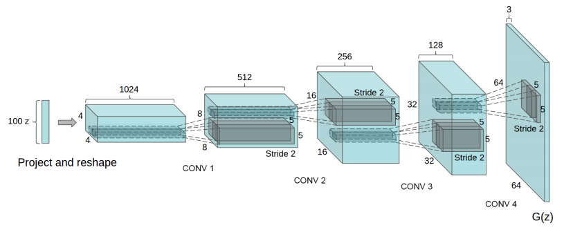
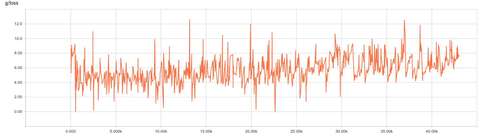
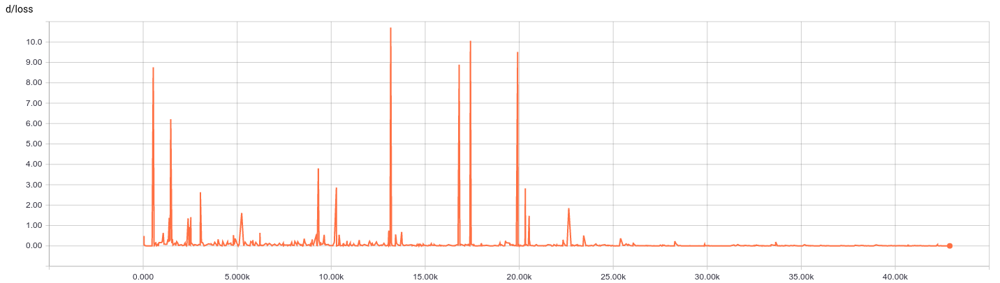
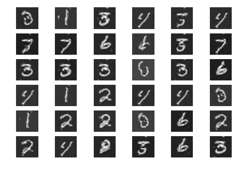
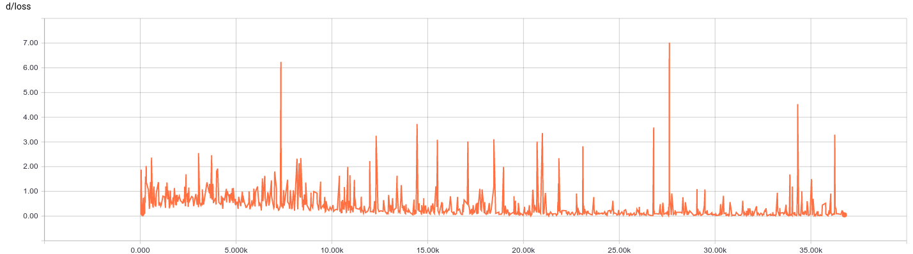
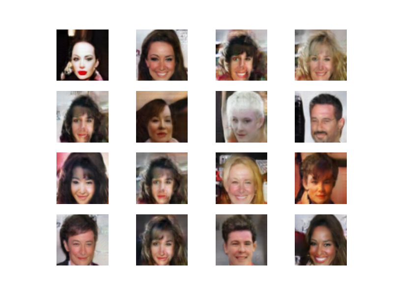

# DCGNA Reimplementation in TensorFLow

Link of the original paper: https://arxiv.org/abs/1511.06434

#### Code

1. src/DCGAN.py is the main implementation

2. src/ops.py consists of different wrapped operations for TensorFlow

3. main.py starts the training on MNIST dataset
(for now it only trains on MNIST.
Other dataset will be implemented in the future)

#### MINIST Results

Generator's Loss:

Discriminator's Loss:

Generated Numbers:

#### CelebA Dataset

Generator's Loss:

Discriminator's loss:

CelebA Dataset(downloaded from http://mmlab.ie.cuhk.edu.hk/projects/CelebA.html):

Generated Faces

#### Reference

https://github.com/carpedm20/DCGAN-tensorflow

https://github.com/yihui-he/GAN-MNIST/blob/master/README.md
